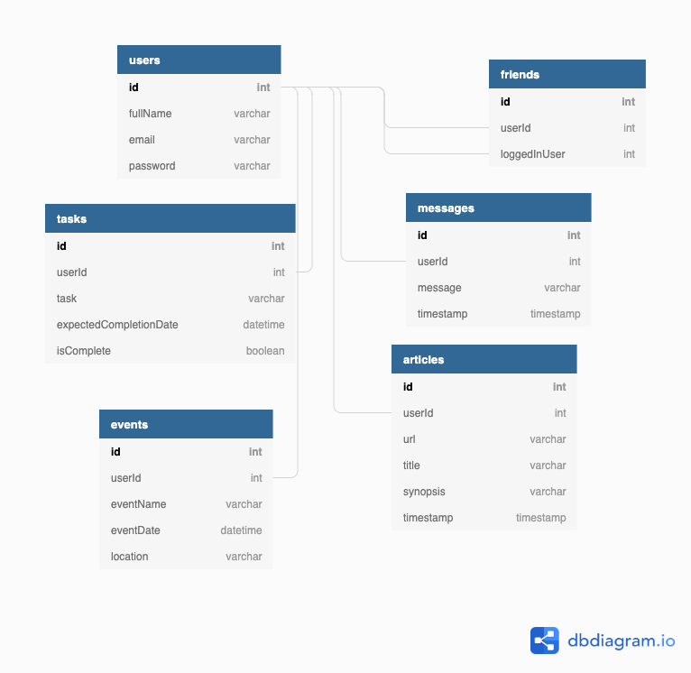

[//]: # (author: James Chapman || purpose: instruct how to install the app and the ERD for it)

# Reactive Nutshell: The Information Dashboard

## Setup: Follow these steps exactly

1. Clone this repository
1. `cd` into the directory it creates
1. In the `api` directory, create a copy of the `database.json.example` and remove the .example extension.
1. Run `npm install` and wait for all dependencies to be installed
1. Run `npm start` to verify that installation was successful.

## ERD

